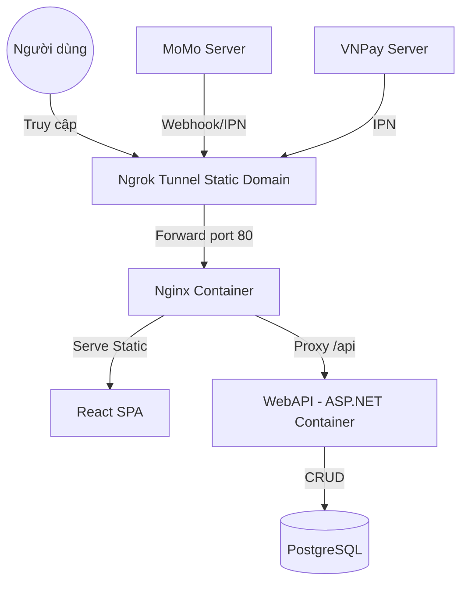

# HelperHub - Hệ thống Tìm kiếm Việc làm & Tuyển dụng Hiện đại

Dự án HelperHub là một nền tảng tuyển dụng thông minh, giúp kết nối Nhà tuyển dụng và Người tìm việc hiệu quả hơn. Hệ thống tích hợp các gói hội viên (Pro/Pro Max), thanh toán trực tuyến và thông báo thời gian thực.

---

## 🚀 Công nghệ sử dụng
- **Backend**: ASP.NET Core 9.0, Entity Framework Core, PostgreSQL/SQLite.
- **Frontend**: React (Vite), TypeScript, Tailwind CSS, Framer Motion.
- **Thanh toán**: VNPay (Môi trường Sandbox/Thử nghiệm).
- **Tính năng mới**: Hệ thống thông báo tự động (Real-time Notifications) cho các hoạt động tài khoản và tuyển dụng.
- **Khác**: Google Login, Ngrok (cho Webhook/IPN testing).

---

## 🐳 Hướng dẫn chạy nhanh bằng Docker (KHUYÊN DÙNG)

> [!IMPORTANT]
> **Ưu điểm khi dùng Docker**: Tự động cấu hình Nginx để tránh lỗi CORS. Cả Frontend và Backend sẽ chạy chung một domain ảo, giúp việc tích hợp thanh toán (Ngrok) trở nên cực kỳ đơn giản.

### 1. Khởi động hệ thống
Mở terminal tại thư mục gốc và chạy:
```bash
docker-compose up --build
```

### 2. Kiến trúc hệ thống qua Docker


---

## 🏗 Thiết lập thủ công (Manual Setup)

### 1. Yêu cầu hệ thống
- [.NET SDK 9.0](https://dotnet.microsoft.com/download/dotnet/9.0)
- [Node.js (LTS)](https://nodejs.org/en)

### 2. Thiết lập Backend (WebTimViec.Api)
1. `cd WebTimViec.Api`
2. `dotnet run` (Chạy tại `http://localhost:5281`)

### 3. Thiết lập Frontend (WebTimViec.Web)
1. `cd WebTimViec.Web`
2. `npm install && npm run dev` (Chạy tại `http://localhost:5173`)

---

## 💳 Hướng dẫn Test Thanh toán (Môi trường Sandbox)

Để test tính năng nâng cấp gói hội viên (Pro/Pro Max), bạn sử dụng các thông tin sau:

### VNPay Sandbox (ATM Nội địa / NCB)
- **Ngân hàng**: Chọn ngân hàng **NCB**
- **Số thẻ**: `9704198526191432198`
- **Tên chủ thẻ**: `NGUYEN VAN A`
- **Ngày phát hành**: `07/15`
- **Mã OTP**: `123456`

### 3. Lưu ý về Ngrok (Quan trọng)
Khi test VNPay IPN (xác nhận thanh toán tự động), bạn **nên** sử dụng Ngrok để server VNPay có thể gọi được App của bạn ở local.

---

## 🛡 Tài khoản Demo (Admin/Roles)
- **Quản trị viên (Admin)**: `admin@webtimviec.com` | `Password123!`
- **Ứng viên (Candidate)**: `worker_1@example.com` | `Password123!`
- **Nhà tuyển dụng (Employer)**: `employer_1@example.com` | `Password123!`
- **User thường**: `user@example.com` | `Password123!`

---

## 📂 Tài liệu chi tiết
- [Huớng dẫn Test Thanh toán chuyên sâu](README_PAYMENT_TEST.md)

---
*Phát triển bởi đội ngũ HelperHub. Chúc bạn tuyển dụng thành công!*
