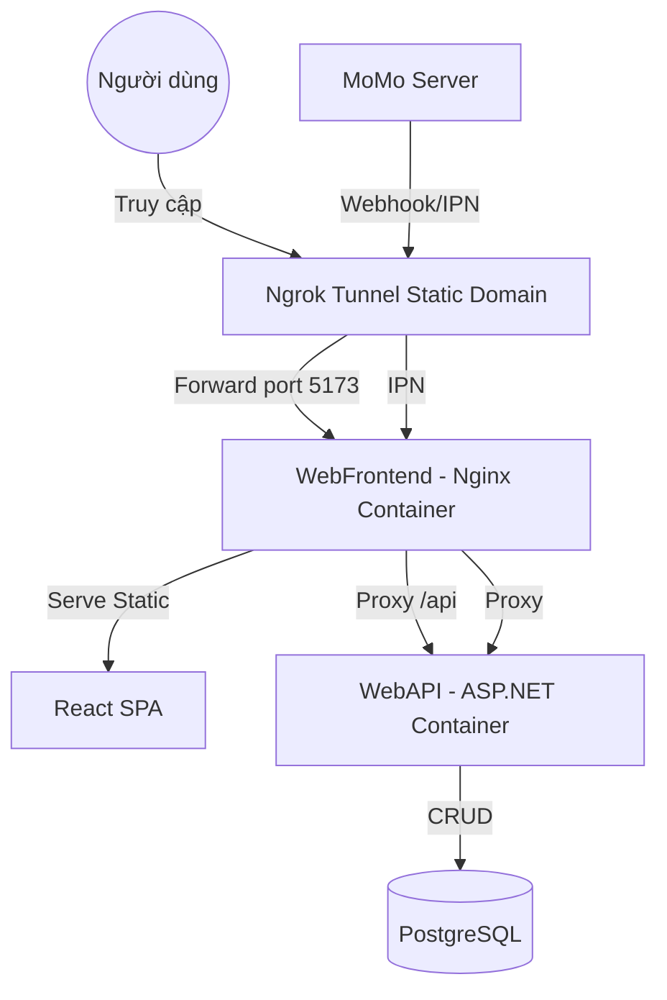

# WebTimViec - Hệ thống Tìm kiếm Việc làm & Tuyển dụng

Dự án WebTimViec là một nền tảng tìm việc làm hiện đại, hỗ trợ người tìm việc và nhà tuyển dụng kết nối với nhau, tích hợp các gói dịch vụ Pro/Pro Max và hệ thống thanh toán điện tử.

---

## 🚀 Công nghệ sử dụng
- **Backend**: ASP.NET Core 9.0, Entity Framework Core, SQLite (Development).
- **Frontend**: React (Vite), TypeScript, Tailwind CSS, Framer Motion.
- **Thanh toán**: MoMo Payment Gateway, VNPay.
- **Khác**: Google Login integration, Ngrok (cho Webhook testing).

---

## 🐳 Hướng dẫn chạy nhanh bằng Docker (KHUYÊN DÙNG)

> [!IMPORTANT]
> **Khuyến khích chạy bằng Docker**: Đây là cách nhanh nhất và ổn định nhất. Việc sử dụng Docker kết hợp với Nginx (trong file `docker-compose.yml`) sẽ giúp bạn **tránh hoàn toàn các lỗi CORS** khi gọi API, vì cả Frontend và Backend đều chạy chung dưới một Domain ảo của Nginx.

Hệ thống được thiết kế để chạy mượt mà trên Docker. Bạn chỉ cần duy nhất 1 lệnh để khởi động toàn dự án (bao gồm DB, API, Web và Ngrok).

### 1. Khởi động hệ thống
Mở terminal tại thư mục gốc và chạy:
```bash
docker-compose up --build
```
*Lưu ý: Nếu bị lỗi network hoặc volume cũ, hãy chạy `docker-compose down` để làm sạch trước.*

### 2. Ưu điểm khi dùng Docker
- **Không lỗi CORS**: Request từ Web sang API được Nginx điều hướng trực tiếp bên trong container.
- **Ngrok tự động**: Domain ngrok được ghim thẳng vào cổng 5173 của Nginx, MoMo có thể IPN về máy bạn mà không cần cấu hình thêm bất kỳ port nào khác.



---

## 🏗 Thiết lập thủ công (Manual Setup)

### 1. Yêu cầu hệ thống
- [.NET SDK 9.0](https://dotnet.microsoft.com/download/dotnet/9.0)
- [Node.js (LTS)](https://nodejs.org/en)

### 2. Thiết lập Backend (WebTimViec.Api)
1. Di chuyển vào thư mục API: `cd WebTimViec.Api`
2. Khởi chạy Server: `dotnet run`
   *Server chạy tại: `http://localhost:5281`*

### 3. Thiết lập Frontend (WebTimViec.Web)
1. Di chuyển vào thư mục Web: `cd WebTimViec.Web`
2. Cấu hình `.env`: `VITE_API_URL=` (để rỗng để dùng proxy vite)
3. Khởi chạy: `npm run dev`
   *Website chạy tại: `http://localhost:5173`*

---

## 💳 Hướng dẫn Test Thanh toán (MoMo/VNPay)
Dự án đã tích hợp Proxy thông minh, vì vậy bạn chỉ cần chạy **ngrok** cho 1 cổng duy nhất.

1. **Static Domain**: Đăng ký domain tại `ngrok.com` dashboard.
2. **Cấu hình**: Cập nhật Domain vào `docker-compose.yml` (nếu dùng docker) HOẶC `appsettings.json`.
3. **Thực hiện**: Bấm "Nâng cấp" trên Web UI và thực hiện thanh toán theo hướng dẫn (OTP MoMo: `0000`).

---

## 🛡 Quản trị viên (Admin)
Đăng nhập tại trang `/login`:
- **Email**: `admin@webtimviec.com`
- **Mật khẩu**: `Password123!`

---

## 📂 Cấu trúc thư mục chính
- `/WebTimViec.Api`: Mã nguồn Server, Controller, Business Logic.
- `/WebTimViec.Web`: Mã nguồn React, các trang giao diện (Job Search, Dashboard, Subscriptions).
- `README_PAYMENT_TEST.md`: Hướng dẫn chuyên sâu về các kịch bản test thanh toán.

---
*Chúc bạn có trải nghiệm tuyệt vời với WebTimViec!*
