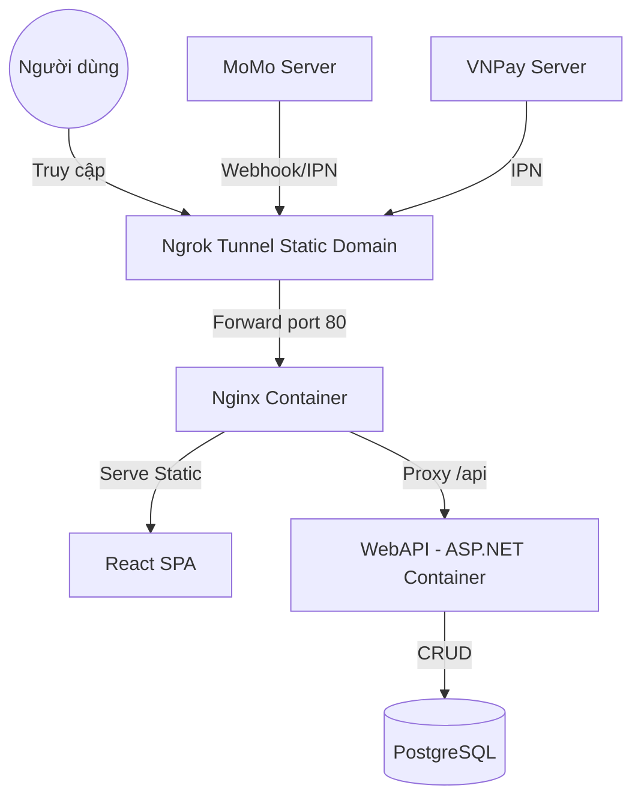

# HelperHub - Hệ thống Tìm kiếm Việc làm & Tuyển dụng Hiện đại

Dự án HelperHub là một nền tảng tuyển dụng thông minh, giúp kết nối Nhà tuyển dụng và Người tìm việc hiệu quả hơn. Hệ thống tích hợp các gói hội viên (Pro/Pro Max), thanh toán trực tuyến và thông báo thời gian thực.

---

## 🚀 Công nghệ sử dụng
- **Backend**: ASP.NET Core 9.0, Entity Framework Core, PostgreSQL/SQLite.
- **Frontend**: React (Vite), TypeScript, Tailwind CSS, Framer Motion.
- **Thanh toán**: VNPay (Môi trường Sandbox/Thử nghiệm).
- **Tính năng mới**: Hệ thống thông báo tự động (Real-time Notifications) cho các hoạt động tài khoản và tuyển dụng.
- **Khác**: Google Login, Ngrok (cho Webhook/IPN testing).

---

## ✨ Các tính năng chính
- **Tìm kiếm & Ứng tuyển**: Tìm kiếm việc làm thông minh với bộ lọc đa dạng. Ứng tuyển nhanh chóng chỉ với 1 click.
- **Quản lý Tuyển dụng**: Nhà tuyển dụng dễ dàng đăng tin, quản lý danh sách ứng viên và hồ sơ ứng tuyển.
- **Hội viên (Subscription)**: Hệ thống các gói cước (Basic/Pro/Enterprise) giúp mở rộng hạn mức xem hồ sơ và đăng tin.
- **Thanh toán Trực tuyến**: Tích hợp cổng thanh toán VNPay (Sandbox) để nâng cấp tài khoản tự động và an toàn.
- **Thông báo Real-time**: Nhận thông báo tức thì (SignalR) khi có người ứng tuyển, duyệt tin hoặc xác nhận thanh toán.
- **Hệ thống Admin**: Bảng quản trị toàn diện dành cho Admin để quản lý Người dùng, Tin tuyển dụng và Gói dịch vụ.
- **Bảo mật & Trải nghiệm**: Đăng nhập bằng Google, xác thực Email (SMTP) và hiệu ứng giao diện mượt mà (Framer Motion).

---

## 🐳 Hướng dẫn chạy nhanh bằng Docker (KHUYÊN DÙNG)

> [!IMPORTANT]
> **Ưu điểm khi dùng Docker**: Tự động cấu hình Nginx để tránh lỗi CORS. Cả Frontend và Backend sẽ chạy chung một domain ảo, giúp việc tích hợp thanh toán (Ngrok) trở nên cực kỳ đơn giản.

### 1. Khởi động hệ thống
Mở terminal tại thư mục gốc và chạy:
```bash
docker-compose up --build
```

### 2. Kiến trúc hệ thống qua Docker


---

## 🏗 Thiết lập thủ công (Manual Setup)

### 1. Yêu cầu hệ thống
- [.NET SDK 9.0](https://dotnet.microsoft.com/download/dotnet/9.0)
- [Node.js (LTS)](https://nodejs.org/en)
- [PostgreSQL 15+](https://www.postgresql.org/download/) (Chạy tại port 5433 hoặc cấu hình lại trong `.env`)

### 2. Thiết lập CSDL & Dữ liệu mẫu (Database)
HelperHub hỗ trợ **2 cách** để bạn có dữ liệu test ngay lập tức:

- **Cách 1: Tự động (Khuyên dùng)**
  Khi bạn chạy `dotnet run` ở Backend lần đầu, hệ thống sẽ tự động thực hiện Migrations (tạo bảng) và Seeding (nạp 100 tin tuyển dụng, 50 ứng viên và các tài khoản demo).
  
- **Cách 2: Sử dụng file SQL Backup**
  Nếu bạn muốn có một "bản chụp" CSDL chuẩn nhất, hãy sử dụng file **`helperhub_db_backup.sql`** đi kèm:
  ```bash
  # Tạo database mới (nếu chưa có)
  psql -U postgres -c "CREATE DATABASE webtimviec;"
  
  # Restore từ file backup
  psql -U postgres -d webtimviec < helperhub_db_backup.sql
  ```

### 3. Thiết lập Backend (WebTimViec.Api)
1. `cd WebTimViec.Api`
2. Tạo file `.env` từ `.env.example` và điền đủ thông tin CSDL.
3. Chạy API: `dotnet run` (Hệ thống sẽ **tự động** tạo bảng và nạp dữ liệu demo khi khởi chạy lần đầu).
4. **Mở cổng thanh toán (Ngrok)**:
   ```bash
   # Cấu hình token (nếu lần đầu)
   ngrok config add-authtoken 31VkjzPhU5XFoPZ2snnde4XvIMd_2bsCFgSiUZ7Ecjn6qV6yZ 
   
   # Chạy tunnel với domain tĩnh
   ngrok http --url=joint-honest-lark.ngrok-free.app 5281
   ```

### 3. Thiết lập Frontend (WebTimViec.Web)
1. `cd WebTimViec.Web`
2. `npm install && npm run dev` (Chạy tại `http://localhost:5173`)

---

## 💳 Hướng dẫn Test Thanh toán (Môi trường Sandbox)

Để test tính năng nâng cấp gói hội viên (Pro/Pro Max), bạn sử dụng các thông tin sau:

### VNPay Sandbox (ATM Nội địa / NCB)
- **Ngân hàng**: Chọn ngân hàng **NCB**
- **Số thẻ**: `9704198526191432198`
- **Tên chủ thẻ**: `NGUYEN VAN A`
- **Ngày phát hành**: `07/15`
- **Mã OTP**: `123456`

### 3. Lưu ý về Ngrok (Quan trọng)
Khi test VNPay IPN (xác nhận thanh toán tự động), bạn **nên** sử dụng Ngrok để server VNPay có thể gọi được App của bạn ở local.

---

## 📂 Cấu trúc mã nguồn (Project Structure)

### 1. Backend (WebTimViec.Api)
Hành não của hệ thống, xử lý Logic nghiệp vụ và CSDL.
- **Controllers/**: Chứa các Endpoint API (Auth, Jobs, Subscriptions, Webhooks...).
- **Data/**: Gồm `AppDbContext.cs` (EF Core) và `DbSeeder.cs` (Nạp dữ liệu mẫu).
- **Entities/**: Các Model CSDL (User, JobPost, Subscription, Notification...).
- **Services/**: Xử lý logic nghiệp vụ chính (VNPay, Email, Google Auth).
- **Hubs/**: Cấu hình SignalR (Real-time Notifications).
- **Program.cs**: File khởi tạo dịch vụ & Middleware.

### 2. Frontend (WebTimViec.Web)
Giao diện người dùng hiện đại, mượt mà.
- **src/components/**: Các thành phần UI dùng chung (Sidebar, Navbar, Modals...).
- **src/pages/**: Các trang chính (Dashboard, Search, Employer Profile, Pricing...).
- **src/services/**: Các hàm gọi API từ Backend (Sử dụng Axios).
- **src/context/**: Quản lý Global State (AuthContext, NotificationContext).
- **src/hooks/**: Các custom hooks dùng chung (useAuth, useNotifications).

---

## 🛡 Tài khoản Demo (Admin/Roles)
- **Quản trị viên (Admin)**: `admin@webtimviec.com` | `Password123!`
- **Ứng viên (Candidate)**: `worker_1@example.com` | `Password123!`
- **Nhà tuyển dụng (Employer)**: `employer_1@example.com` | `Password123!`

---

## 📂 Tài liệu chi tiết
- [Huớng dẫn Test Thanh toán chuyên sâu](README_PAYMENT_TEST.md)

---
*Phát triển bởi đội ngũ HelperHub. Chúc bạn tuyển dụng thành công!*
